# 🚦 Road Accident Analysis ETL Pipeline

## 📌 Project Overview
This project demonstrates an **end-to-end ETL pipeline for Road Accident Analysis** built on **Databricks**.  
It ingests raw accident data, applies quality checks, transforms it into clean datasets, and enables visual dashboards for decision-making.  
The pipeline follows the **Medallion Architecture (Bronze → Silver → Gold)** and ensures **data governance, security, and scalability**.

---

## 🛠️ Technology Stack
- **Python & SQL** – Data processing & queries  
- **Databricks Notebook** – ETL orchestration  
- **Auto Loader** – Scalable ingestion with schema evolution  
- **Delta Lake** – Bronze, Silver, and Gold tables  
- **Unity Catalog** – Security & access control  
- **Serverless SQL** – Interactive queries & reporting  

---

## 🔄 ETL Pipeline Stages
1. **Data Generation** – Faker + Spark to simulate accident records  
2. **Data Ingestion (Bronze)** – Databricks Auto Loader with schema evolution  
3. **Data Quality (Silver)** – Validations + split into good/bad records  
4. **Aggregation (Gold)** – Accident insights (area, severity, weather, causes, etc.)  
5. **Security (Unity Catalog)** – RBAC & dynamic masking on sensitive fields  
6. **Visualization** – Dashboards for accident trends and insights  

---

## 📊 Pipeline Workflow
Here’s the **Databricks Job & Pipeline image** (uploaded in repository):  

<div align="center">
    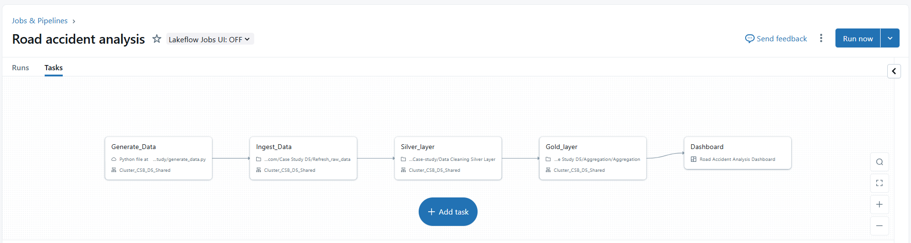
</div>


## 📊 Dashboard Insights

The final dashboards provide **business-ready visualizations** from the Gold Layer tables.  

### Area-Wise Total Accidents
Identifies accident hotspots for infrastructure planning.
```sql
SELECT 
    Area_accident_occured AS area,
    Total_Accidents
FROM csb_grp_5.autoloader_pipeline.area_year_accidents
ORDER BY total_accidents DESC;
```
<div align="center">
    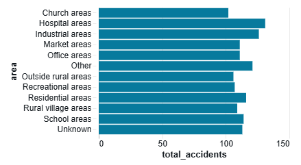
</div>

### Day of Week Accident Trend
Highlights weekdays/weekends with higher risks.
```sql
SELECT 
    Day_of_week,
    COUNT(*) AS total_accidents
FROM csb_grp_5.autoloader_pipeline.death_report_details
GROUP BY Day_of_week
ORDER BY 
    CASE Day_of_week
        WHEN 'Sunday' THEN 1
        WHEN 'Monday' THEN 2
        WHEN 'Tuesday' THEN 3
        WHEN 'Wednesday' THEN 4
        WHEN 'Thursday' THEN 5
        WHEN 'Friday' THEN 6
        WHEN 'Saturday' THEN 7
    END;
```
<div align="center">
    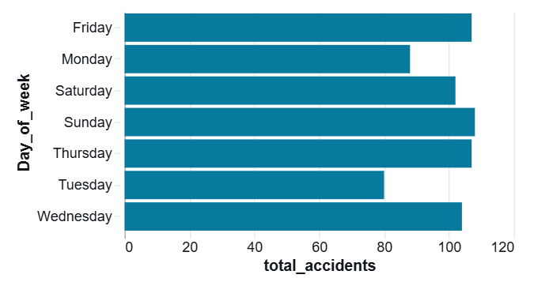
</div>

### Hour of Day Accident Trend
Shows peak accident hours for better resource allocation.
```sql
SELECT 
    hour(try_to_timestamp(Time, 'H:mm:ss')) AS hour_of_day,
    COUNT(*) AS total_accidents
FROM csb_grp_5.autoloader_pipeline.death_report_details
GROUP BY hour(try_to_timestamp(Time, 'H:mm:ss'))
ORDER BY hour_of_day;
```
<div align="center">
    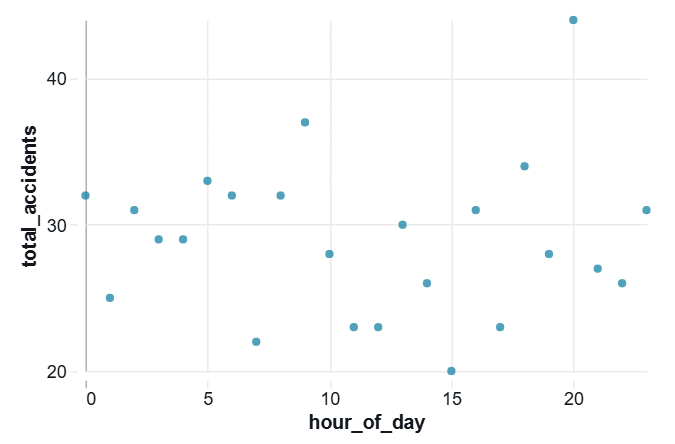
</div>

### Accident Severity Distribution
Breakdown into fatal, serious, and minor categories.
```sql
SELECT 
    Accident_severity,
    Count
FROM csb_grp_5.autoloader_pipeline.accident_severity_breakdown;
```
<div align="center">
    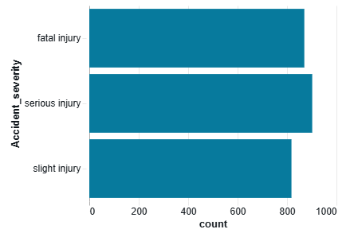
</div>

### Gender-wise Fatalities
Compares accident impact by gender.
```sql
SELECT 
    Sex_of_driver, 
    Casualty_severity,
    COUNT(*) AS death_count
FROM csb_grp_5.autoloader_pipeline.death_report_details
WHERE Casualty_severity = :severity
GROUP BY Sex_of_driver, Casualty_severity;
```
<div align="center">
    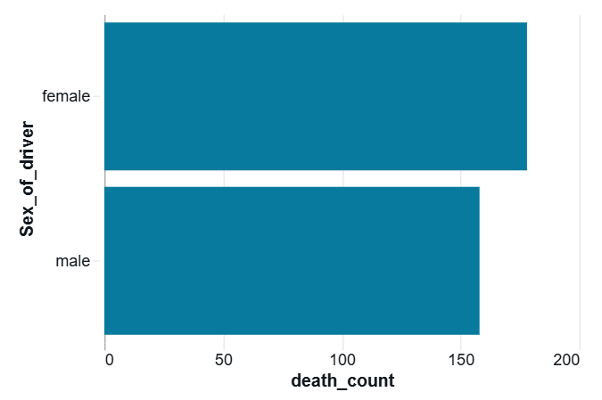
</div>

### Age Band Fatalities
Identifies vulnerable age groups.
```sql
SELECT 
    Age_band_of_driver,
    COUNT(*) AS fatal_accidents
FROM csb_grp_5.autoloader_pipeline.death_report_details
WHERE Casualty_severity = 'Serious Injury'
GROUP BY Age_band_of_driver
ORDER BY fatal_accidents DESC;
```
<div align="center">
    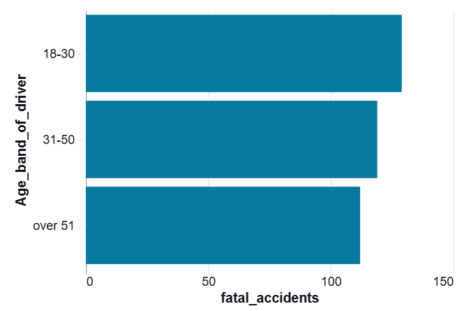
</div>

### Driving Experience vs. Accident Count
Links experience level with accident likelihood.
```sql
SELECT 
    Driving_experience,
    COUNT(*) AS total_accidents
FROM csb_grp_5.autoloader_pipeline.death_report_details
GROUP BY Driving_experience
ORDER BY total_accidents DESC;
```
<div align="center">
    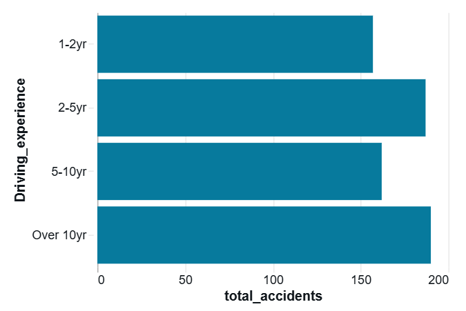
</div>

### Weather-wise Accidents
Shows accident distribution under Normal, Rain, Fog, etc.
```sql
SELECT 
    Cause_of_accident,
    COUNT(*) AS total_accidents
FROM csb_grp_5.autoloader_pipeline.death_report_details
WHERE Weather_conditions IN (:weather)
GROUP BY Cause_of_accident
ORDER BY total_accidents DESC
LIMIT 10;
```
<div align="center">
    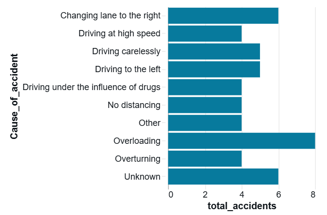
</div>

### Road Surface Conditions
Correlates road quality with accident frequency.
```sql
SELECT 
    Road_surface_conditions,
    COUNT(*) AS total_accidents
FROM csb_grp_5.autoloader_pipeline.death_report_details
GROUP BY Road_surface_conditions
ORDER BY total_accidents DESC;
```
<div align="center">
    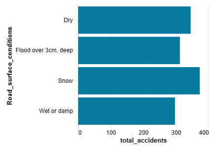
</div>

### Light Condition Accidents
Compares daylight vs. night-time accidents.
```sql
SELECT 
    Light_conditions,
    COUNT(*) AS total_accidents
FROM csb_grp_5.autoloader_pipeline.death_report_details
GROUP BY Light_conditions
ORDER BY total_accidents DESC;
```
<div align="center">
    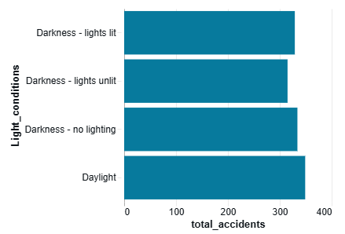
</div>

### Top 10 Causes of Accidents
Lists overspeeding, distractions, and other key causes.
```sql
SELECT 
    Cause_of_accident,
    COUNT(*) AS total_accidents
FROM csb_grp_5.autoloader_pipeline.death_report_details
GROUP BY Cause_of_accident
ORDER BY total_accidents DESC
LIMIT 10;
```
<div align="center">
    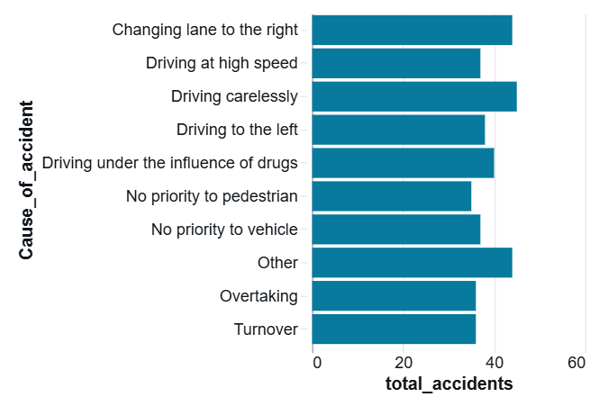
</div>

---

## 📜 Complete Project Code

This section contains **all project files with explanations**.

<details>
<summary>🔹 aggregation.py</summary>

```python
from pyspark.sql.functions import count, year, col, to_timestamp

# Read the existing table
df = spark.table("csb_grp_5.autoloader_pipeline.silver_filtered_data")

# 1. State-wise Total Accidents by Year
# Extract Year from Time column
df_with_year = df.withColumn("Year", year(to_timestamp(col("Time"))))

# Group by Area_accident_occured and Year
state_year_df = df_with_year.groupBy("Area_accident_occured", "Year").agg(count("*").alias("Total_Accidents"))
# Save the result
state_year_df.write.mode("overwrite").saveAsTable("csb_grp_5.autoloader_pipeline.area_year_accidents")

# 2. Accident Severity Breakdown
severity_df = df.groupBy("Accident_severity").agg(count("*").alias("Count"))
severity_df.write.mode("overwrite").saveAsTable("csb_grp_5.autoloader_pipeline.accident_severity_breakdown")

# Filter for deceased individuals (Casualty_severity == "Fatal injury" or "Serious Injury")
death_report_df = df.filter(col("Casualty_severity").isin("Fatal injury", "Serious Injury")).select(
    "Sex_of_casualty",
    "Age_band_of_casualty",
    "Day_of_week",
    "Time",
    "Area_accident_occured",
    "Cause_of_accident",
    "Accident_severity",
    "Light_conditions",
    "Road_surface_conditions",
    "Driving_experience",
    "Weather_conditions",
    "Age_band_of_driver",
    "Sex_of_driver",
    "Casualty_severity"
)
death_report_df.write.mode("overwrite").saveAsTable("csb_grp_5.autoloader_pipeline.death_report_details")
```

</details>

<details>
<summary>🔹 autoloader.py</summary>

```python
from pyspark.sql.functions import *
from pyspark.sql.types import StructType, StringType, IntegerType

# Define input and checkpoint paths
input_path = "/Volumes/databricks_csb_grp_5/default/accident_data"
checkpoint_path = "/Volumes/databricks_csb_grp_5/default/autoloader_checkpoint"
output_path = "/Volumes/csb_grp_5/autoloader_pipeline/raw_data"

# Read new files using Autoloader
df = (
    spark.readStream
        .format("cloudFiles")
        .option("cloudFiles.format", "csv")  # or "csv", "parquet", etc.
        .option("cloudFiles.inferSchema", "true")
        .option("cloudFiles.schemaLocation", checkpoint_path)  
        .load(input_path)
)

# Write to Delta Lake or display in console
query = (
    df.writeStream
      .format("delta")
      .option("checkpointLocation", checkpoint_path)
      .outputMode("append")
      .start(output_path)
)
```

</details>

<details>
<summary>🔹 DataCleaningSilverLayer.py</summary>

```python
from pyspark.sql import SparkSession
from pyspark.sql.functions import col, when, lit, to_timestamp, expr, trim, lower
import logging

# Configure logging
logging.basicConfig(level=logging.INFO)
logger = logging.getLogger("AccidentDataCleaning")

def main():
    try:
        spark = SparkSession.builder.appName("AccidentDataCleaning").getOrCreate()
        logger.info("Spark session started.")

        # Define valid values
        valid_sex = ["male", "female"]
        valid_accident_severity = ["slight injury", "serious injury", "fatal injury"]
        valid_age_band = ["18-30", "31-50", "under 18", "over 51"]

        # Load data from DBFS file
        # file_path = "dbfs:/mnt/bronze/accident_data.csv"
        try:
            bronze_df = spark.read.table('csb_grp_5.autoloader_pipeline.bronze_table')
            logger.info("Data loaded from DBFS file successfully.")
        except Exception as e:
            logger.error(f"Failed to read data from DBFS file: {e}")
            return

        df = bronze_df.withColumn("Number_of_vehicles_involved",
                        when(col("Number_of_vehicles_involved").isNull(), lit(1))
                        .otherwise(col("Number_of_vehicles_involved").cast("int")))

        df = df.withColumn("Number_of_casualties",
                        when(col("Number_of_casualties").isNull(), lit(1))
                        .otherwise(col("Number_of_casualties").cast("int")))
        
        df = df.withColumn("Time_cleaned", expr("try_cast(Time as timestamp)"))

        # Normalize categorical columns: strip whitespace and convert to lowercase
        categorical_columns = [
            "Age_band_of_driver", "Sex_of_driver", "Sex_of_casualty",
            "Age_band_of_casualty", "Accident_severity"
        ]
        for col_name in categorical_columns:
            df = df.withColumn(col_name, lower(trim(col(col_name))))

        # Replace 'na', '-', and empty strings with nulls in validation columns
        for col_name in ["Day_of_week", "Cause_of_accident"]:
            df = df.withColumn(col_name, when((col(col_name).isin("na", "-", "")), None).otherwise(col(col_name)))
        
        cleaned_df = df.withColumn("is_valid",
            when(
                col("Time_cleaned").isNotNull() &
                col("Day_of_week").isNotNull() &
                col("Age_band_of_driver").isin(valid_age_band) &
                col("Sex_of_driver").isin(valid_sex) &
                col("Sex_of_casualty").isin(valid_sex) &
                col("Age_band_of_casualty").isin(valid_age_band) &
                col("Cause_of_accident").isNotNull() &
                col("Area_accident_occured").isNotNull() &
                col("Accident_severity").isin(valid_accident_severity),
                True
            ).otherwise(False)
        )
        display(cleaned_df)
        # Split good and bad data
        good_data_df = cleaned_df.filter(col("is_valid") == True).drop("is_valid")
        bad_data_df = cleaned_df.filter(col("is_valid") == False).drop("is_valid")

        # Write good data to Delta format and register as table
        try:
            good_data_df.write.format("delta").mode("overwrite").saveAsTable("csb_grp_5.autoloader_pipeline.silver_filtered_data")
            logger.info("Good data written to silver_filtered_data.")
        except Exception as e:
            logger.error(f"Failed to write good data to Silver table: {e}")

        try:
            bad_data_df.write.format("delta").mode("overwrite").saveAsTable("csb_grp_5.autoloader_pipeline.silver_filtered_bad_data")
            logger.info("Bad data written to silver_filtered_bad_data.")
        except Exception as e:
            logger.error(f"Failed to write bad data to Silver table: {e}")

    except Exception as e:
        logger.exception(f"Unexpected error occurred: {e}")

if __name__ == "__main__":
    main()
```

</details>

<details>
<summary>🔹 DataGeneration.txt (logs)</summary>

```
2025-08-20 11:49:21,971 - INFO - Starting dataset generation...
2025-08-20 11:49:22,001 - WARNING - Corruption: Field 'Number_of_casualties' replaced with NONSENSE value 'Likely scene.'
2025-08-20 11:49:22,003 - WARNING - Corruption: Field 'Type_of_collision' replaced with NONSENSE value 'Vote couple.'
2025-08-20 11:49:22,006 - WARNING - Corruption: Field 'Service_year_of_vehicle' set to MISSING
...existing log lines...
```

</details>

<details>
<summary>🔹 GenerateData.py</summary>

```python
import random
import pandas as pd
from faker import Faker
import logging
import variables
import uuid
import os
import traceback

logging.basicConfig(
    level=logging.INFO,
    format="%(asctime)s - %(levelname)s - %(message)s",
    handlers=[logging.FileHandler("data_generation.log"), logging.StreamHandler()]
)

class DataGenerator:
    def __init__(self, no_of_records=1000):
        self.fake = Faker()
        self.NUM_RECORDS = no_of_records
        self.CORRUPTION_RATE = 0.2

    def random_choice(self, values):
        if isinstance(values, list):
            return random.choice(values)
        else:
            return random.choice(values.split(","))

    def generate_valid_record(self):
        return {
            "Time": self.fake.time(pattern="%H:%M:%S"),
            "Day_of_week": self.random_choice(variables.DAYS_OF_WEEKS),
            "Age_band_of_driver": self.random_choice("18-30,31-50,Over 51,Unknown"),
            "Sex_of_driver": self.random_choice("Male,Female,Unknown"),
            "Educational_level": self.random_choice(variables.EDUCATION_LEVEL),
            "Vehicle_driver_relation": self.random_choice("Owner,Employee,Unknown"),
            "Driving_experience": self.random_choice("1-2yr,2-5yr,5-10yr,Over 10yr,Unknown"),
            "Type_of_vehicle": self.random_choice(variables.VEHICLE_TYPE),
            "Owner_of_vehicle": self.random_choice("Owner,Government,Other,Unknown"),
            "Service_year_of_vehicle": random.randint(1, 30),
            "Defect_of_vehicle": self.random_choice("No defect,Brake failure,Steering failure,Tyre burst,Other"),
            "Area_accident_occured": self.random_choice(variables.ACCIDENT_AREA),
            "Lanes_or_Medians": self.random_choice(variables.LANES_OR_MEDIANS),
            "Road_allignment": self.random_choice(variables.ROAD_ALIGNMENT),
            "Types_of_Junction": self.random_choice(variables.TYPES_OF_JUNCTION),
            "Road_surface_type": self.random_choice(variables.ROAD_SURFACE_TYPE),
            "Road_surface_conditions": self.random_choice(variables.ROAD_SURFACE_CONDITIONS),
            "Light_conditions": self.random_choice(variables.LIGHT_CONDITIONS),
            "Weather_conditions": self.random_choice(variables.WEATHER_CONDITIONS),
            "Type_of_collision": self.random_choice(variables.TYPE_OF_COLLISION),
            "Number_of_vehicles_involved": random.randint(1, 5),
            "Number_of_casualties": random.randint(0, 5),
            "Vehicle_movement": self.random_choice(variables.VEHICLE_MOVEMENT),
            "Casualty_class": self.random_choice(variables.CASUALTY_CLASS),
            "Sex_of_casualty": self.random_choice("Male,Female,Unknown"),
            "Age_band_of_casualty": self.random_choice("Under 18,18-30,31-50,Over 51,Unknown"),
            "Casualty_severity": self.random_choice(variables.ACCIDENT_SEVERITY),
            "Work_of_casuality": self.random_choice("Employed,Unemployed,Student,Unknown"),
            "Fitness_of_casuality": self.random_choice(variables.FITNESS_OF_CASUALITY),
            "Pedestrian_movement": self.random_choice(variables.PEDESTRIAN_MOVEMENT),
            "Cause_of_accident": self.random_choice(variables.CAUSE_OF_ACCIDENT),
            "Accident_severity": self.random_choice(variables.ACCIDENT_SEVERITY),
        }

    def generate_corrupted_record(self, valid_record):
        record = valid_record.copy()
        field_to_corrupt = random.choice(list(record.keys()))
        corruption_type = random.choice(["missing", "nonsense", "negative"])
        if corruption_type == "missing":
            record[field_to_corrupt] = None
            logging.warning(f"Corruption: Field '{field_to_corrupt}' set to MISSING")
        elif corruption_type == "nonsense":
            nonsense_value = self.fake.text(max_nb_chars=15)
            record[field_to_corrupt] = nonsense_value
            logging.warning(f"Corruption: Field '{field_to_corrupt}' replaced with NONSENSE value '{nonsense_value}'")
        elif corruption_type == "negative" and isinstance(record[field_to_corrupt], int):
            negative_value = -abs(record[field_to_corrupt])
            record[field_to_corrupt] = negative_value
            logging.warning(f"Corruption: Field '{field_to_corrupt}' set to NEGATIVE value '{negative_value}'")
        return record

    def generate_dataset(self):
        data = []
        for i in range(self.NUM_RECORDS):
            valid_record = self.generate_valid_record()
            if random.random() < self.CORRUPTION_RATE:
                # corrupted = self.generate_corrupted_record(valid_record)
                # data.append(corrupted)
                print("Corrupt Data Generated.")
            else:
                data.append(valid_record)
        sdf = spark.createDataFrame(data)
        return sdf

if __name__ == "__main__":
    logging.info("Starting dataset generation...")
    try:
        data_generator = DataGenerator(2000)
        sdf = data_generator.generate_dataset()
        output_path = "/Volumes/databricks_csb_grp_5/default/accident_data"
        print(f"Count of the rows: {sdf.count()}")
        sdf.write.mode("append").option("header", True).csv(output_path)
        logging.info("Dataset generated and saved to accident_data_with_corruption.csv")
        logging.info("Corruption log saved to data_generation.log")
    except Exception as e:
        logging.error(f"Error saving dataset: {e}")
        traceback.print_exc()
```

</details>

<details>
<summary>🔹 RBAC.py</summary>

```sql
%md
Created a table to manage user access

%sql
-- Step 1: Create User-Group Mapping Table
CREATE OR REPLACE TABLE databricks_csb_grp_5.default.user_groups (
  username STRING,
  groupname STRING
);

-- Insert sample user-group data
INSERT INTO databricks_csb_grp_5.default.user_groups VALUES
  ('ayeujjawalsingh@gmail.com', 'data_analysts'),
  ('shashank@gmail.com', 'data_analysts'),
  ('nayan@gmail.com', 'data_readers'),
  ('neha@gmail.com', 'data_readers');

-- Step 2: Create Base Table Schema (replace with your actual table)

%sql
select * from databricks_csb_grp_5.default.silver_filtered_data limit 2

%sql
SELECT DISTINCT username
  FROM databricks_csb_grp_5.default.user_groups
  WHERE username = current_user() AND groupname = 'data_analysts'

%sql
-- Step 3: Create View 1 - Basic Accident Info with group-based masking
CREATE OR REPLACE VIEW databricks_csb_grp_5.default.vw_accident_basic_info AS
WITH user_group_flag AS (
  SELECT DISTINCT username
  FROM databricks_csb_grp_5.default.user_groups
  WHERE username = current_user() AND groupname = 'data_analysts'
)
SELECT
  d.Time,
  d.Day_of_week,
  d.Area_accident_occured,
  
  CASE 
    WHEN ug.username IS NOT NULL THEN d.Sex_of_driver
    ELSE 'MASKED' 
  END AS Sex_of_driver,
  
  CASE 
    WHEN ug.username IS NOT NULL THEN d.Age_band_of_driver
    ELSE 'MASKED'
  END AS Age_band_of_driver,
  
  CASE 
    WHEN ug.username IS NOT NULL THEN d.Owner_of_vehicle
    ELSE 'MASKED'
  END AS Owner_of_vehicle,

  d.Type_of_collision,
  d.Weather_conditions,
  d.Light_conditions
FROM databricks_csb_grp_5.default.silver_filtered_data d
LEFT JOIN user_group_flag ug ON TRUE;

-- Step 4: Create View 2 - Vehicle and Driver Details with masking
CREATE OR REPLACE VIEW databricks_csb_grp_5.default.vw_vehicle_driver_details AS
WITH user_group_flag AS (
  SELECT DISTINCT username
  FROM databricks_csb_grp_5.default.user_groups
  WHERE username = current_user() AND groupname = 'data_analysts'
)
SELECT
  d.Time,  d.Area_accident_occured,  
  CASE 
    WHEN ug.username IS NOT NULL THEN d.Sex_of_driver
    ELSE 'MASKED' 
  END AS Sex_of_driver,
    CASE 
    WHEN ug.username IS NOT NULL THEN d.Age_band_of_driver
    ELSE 'MASKED'
  END AS Age_band_of_driver,
    CASE 
    WHEN ug.username IS NOT NULL THEN d.Owner_of_vehicle
    ELSE 'MASKED'
  END AS Owner_of_vehicle,
  
  d.Educational_level,
  d.Vehicle_driver_relation,
  d.Driving_experience,
  d.Type_of_vehicle,
  d.Service_year_of_vehicle,
  d.Defect_of_vehicle
FROM databricks_csb_grp_5.default.silver_filtered_data d
LEFT JOIN user_group_flag ug ON TRUE;

-- Step 5: Create View 3 - Road and Environmental Conditions with masking
CREATE OR REPLACE VIEW databricks_csb_grp_5.default.vw_road_environmental_conditions AS
WITH user_group_flag AS (
  SELECT DISTINCT username
  FROM databricks_csb_grp_5.default.user_groups
  WHERE username = current_user() AND groupname = 'data_analysts'
)
SELECT
  d.Time,
  d.Area_accident_occured,
  
  CASE 
    WHEN ug.username IS NOT NULL THEN d.Sex_of_driver
    ELSE 'MASKED' 
  END AS Sex_of_driver,
  
  CASE 
    WHEN ug.username IS NOT NULL THEN d.Age_band_of_driver
    ELSE 'MASKED'
  END AS Age_band_of_driver,
  
  CASE 
    WHEN ug.username IS NOT NULL THEN d.Owner_of_vehicle
    ELSE 'MASKED'
  END AS Owner_of_vehicle,

  d.Road_allignment,
  d.Road_surface_type,
  d.Road_surface_conditions,
  d.Weather_conditions,
  d.Light_conditions,
  d.Lanes_or_Medians,
  d.Types_of_Junction
FROM databricks_csb_grp_5.default.silver_filtered_data d
LEFT JOIN user_group_flag ug ON TRUE;

%sql
--update databricks_csb_grp_5.default.user_groups set groupname='data_analysts' where username='shashank@gmail.com'
update databricks_csb_grp_5.default.user_groups set groupname='data_readers' where username='shashank@gmail.com'

%sql
select * from databricks_csb_grp_5.default.vw_accident_basic_info
```

</details>

<details>
<summary>🔹 RoadAccidentAnalysisNotebook.py</summary>

```sql
%md
# 🚦 Road Accident Analysis – Gold Layer Dashboard

This notebook contains SQL queries on the Gold Layer table:
**`databricks_csb_grp_5.default.gold_accident_data`**

The queries generate insights for the final dashboard:
- Area-wise accident trends
- Accident severity breakdown
- Demographic analysis (Age, Gender, Driving Experience)
- Environmental factors (Weather, Road, Light conditions)
- Causes of accidents

%md
## 1. Area-wise Total Accidents
Shows which **areas** have the highest number of accidents.

%sql
SELECT 
    Area_accident_occured AS area,
    Total_Accidents
FROM databricks_csb_grp_5.default.area_year_accidents
ORDER BY total_accidents DESC;

%md
## 2. Day of Week Accident Trend
Displays accident counts by **day of the week** (Monday–Sunday).

%sql
SELECT 
    Day_of_week,
    COUNT(*) AS total_accidents
FROM csb_grp_5.autoloader_pipeline.death_report_details
GROUP BY Day_of_week
ORDER BY total_accidents DESC;

%md
## 3. Hour of Day Accident Trend
Shows accidents by **hour of the day** to identify **peak accident hours**.

%sql
-- not required
SELECT 
    hour(try_to_timestamp(Time, 'H:mm:ss')) AS hour_of_day,
    COUNT(*) AS total_accidents
FROM csb_grp_5.autoloader_pipeline.death_report_details
GROUP BY hour(try_to_timestamp(Time, 'H:mm:ss'))
ORDER BY hour_of_day;

%md
## 4. Accident Severity Distribution
Provides a severity split (Fatal, Serious, Minor, Slight injury).

%sql
SELECT 
    Accident_severity,
    Count
FROM csb_grp_5.autoloader_pipeline.accident_severity_breakdown;

%md
## 5. Gender-wise Fatalities
Breaks down **fatal accidents by gender**.

dbutils.widgets.dropdown(
    name="severity",                # widget variable name
    defaultValue="Serious Injury",    # default value
    choices=["Fatal injury", "Serious Injury", "Slight Injury"], 
    label="Select Accident Severity"
)

%sql
SELECT 
    Sex_of_driver, 
    Casualty_severity,
    COUNT(*) AS death_count
FROM csb_grp_5.autoloader_pipeline.death_report_details
WHERE Casualty_severity = :severity
GROUP BY Sex_of_driver, Casualty_severity;

%md
## 6. Age Band Fatalities
Shows **fatalities by driver’s age group**.

%sql
SELECT 
    Age_band_of_driver,
    COUNT(*) AS fatal_accidents
FROM csb_grp_5.autoloader_pipeline.death_report_details
WHERE Casualty_severity = 'Serious Injury'
GROUP BY Age_band_of_driver
ORDER BY fatal_accidents DESC;

%md
## 7. Driving Experience vs Accident Count
Compares accident counts across **driving experience levels**.

%sql
SELECT 
    Driving_experience,
    COUNT(*) AS total_accidents
FROM csb_grp_5.autoloader_pipeline.death_report_details
GROUP BY Driving_experience
ORDER BY total_accidents DESC;

%md
## 8. Weather-wise Accidents
Displays accidents across **weather conditions**.

%sql
-- discard
-- SELECT 
--     Weather_conditions,
--     COUNT(*) AS total_accidents
-- FROM databricks_csb_grp_5.default.gold_accident_data
-- GROUP BY Weather_conditions
-- ORDER BY total_accidents DESC;

dbutils.widgets.dropdown(
    name="weather",
    defaultValue="Normal",
    choices=["Normal", "Raining", "Fog", "Other"],
    label="Select Weather Condition"
)

%sql
SELECT 
    Cause_of_accident,
    COUNT(*) AS total_accidents
FROM csb_grp_5.autoloader_pipeline.death_report_details
WHERE Weather_conditions IN (:weather)
GROUP BY Cause_of_accident
ORDER BY total_accidents DESC
LIMIT 10;

%md
## 9. Road Surface Conditions
Shows accident counts based on **road surface condition**.

%sql
SELECT 
    Road_surface_conditions,
    COUNT(*) AS total_accidents
FROM csb_grp_5.autoloader_pipeline.death_report_details
GROUP BY Road_surface_conditions
ORDER BY total_accidents DESC;

%md
## 10. Light Condition Accidents
Breaks accidents down by **light conditions**.

%sql
SELECT 
    Light_conditions,
    COUNT(*) AS total_accidents
FROM csb_grp_5.autoloader_pipeline.death_report_details
GROUP BY Light_conditions
ORDER BY total_accidents DESC;

%md
## 11. Top 10 Causes of Accidents
Lists the **top 10 reasons for accidents**.

%sql
SELECT 
    Cause_of_accident,
    COUNT(*) AS total_accidents
FROM csb_grp_5.autoloader_pipeline.death_report_details
GROUP BY Cause_of_accident
ORDER BY total_accidents DESC
LIMIT 10;
```

</details>

<details>
<summary>🔹 variables.py</summary>

```python
import calendar

DAYS_OF_WEEKS = list(calendar.day_name)
VEHICLE_TYPE = "Automobile,Public (> 45 seats),Lorry (41?100Q),Public (13?45 seats),Lorry (11?40Q),Long lorry,Public (12 seats),Taxi,Pick up upto 10Q,Stationwagen,Ridden horse,Other,Bajaj,Turbo,Motorcycle,Special vehicle,Bicycle"
ACCIDENT_AREA = "Residential areas,Office areas,Recreational areas,Industrial areas,Other,Church areas,Market areas,Unknown,Rural village areas,Outside rural areas,Hospital areas,School areas"
LANES_OR_MEDIANS = "Undivided Two way,other,Double carriageway (median),One way,Two-way (divided with solid lines road marking),Two-way (divided with broken lines road marking),Unknown"
EDUCATION_LEVEL = "Above high school,Junior high school,Elementary school,High school,Unknown,Illiterate,Writing & reading"
ROAD_ALIGNMENT = (
    "Tangent road with flat terrain,"
    "Tangent road with mild grade and flat terrain,"
    "Escarpments,"
    "Tangent road with rolling terrain,"
    "Gentle horizontal curve,"
    "Tangent road with mountainous terrain and,"
    "Steep grade downward with mountainous terrain,"
    "Sharp reverse curve,"
    "Steep grade upward with mountainous terrain"
)

TYPES_OF_JUNCTION = "No junction,Y Shape,Crossing,O Shape,Other,Unknown,T Shape,X Shape"

ROAD_SURFACE_TYPE = "Asphalt roads,Earth roads,Asphalt roads with some distress,Gravel roads,Other"

ROAD_SURFACE_CONDITIONS = "Dry,Wet or damp,Snow,Flood over 3cm. deep"

LIGHT_CONDITIONS = "Daylight,Darkness - lights lit,Darkness - no lighting,Darkness - lights unlit"

WEATHER_CONDITIONS = "Normal,Raining,Raining and Windy,Cloudy,Other,Windy,Snow,Unknown,Fog or mist"

TYPE_OF_COLLISION = (
    "Collision with roadside-parked vehicles,"
    "Vehicle with vehicle collision,"
    "Collision with roadside objects,"
    "Collision with animals,"
    "Other,"
    "Rollover,"
    "Fall from vehicles,"
    "Collision with pedestrians,"
    "With Train,"
    "Unknown"
)

VEHICLE_MOVEMENT = (
    "Going straight,U-Turn,Moving Backward,Turnover,Waiting to go,Getting off,"
    "Reversing,Unknown,Parked,Stopping,Overtaking,Other,Entering a junction"
)

CASUALTY_CLASS = "na,Driver or rider,Pedestrian,Passenger"

FITNESS_OF_CASUALITY = "Normal,Deaf,Other,Blind,NormalNormal"

PEDESTRIAN_MOVEMENT = (
    "Not a Pedestrian,"
    "Crossing from driver's nearside,"
    "Crossing from nearside - masked by parked or statioNot a Pedestrianry vehicle,"
    "Unknown or other,"
    "Crossing from offside - masked by  parked or statioNot a Pedestrianry vehicle,"
    "In carriageway, statioNot a Pedestrianry - not crossing  (standing or playing),"
    "Walking along in carriageway, back to traffic,"
    "Walking along in carriageway, facing traffic,"
    "In carriageway, statioNot a Pedestrianry - not crossing  (standing or playing) - masked by parked or statioNot a Pedestrianry vehicle"
)

CAUSE_OF_ACCIDENT = (
    "Moving Backward,Overtaking,Changing lane to the left,Changing lane to the right,Overloading,"
    "Other,No priority to vehicle,No priority to pedestrian,No distancing,Getting off the vehicle improperly,"
    "Improper parking,Overspeed,Driving carelessly,Driving at high speed,Driving to the left,Unknown,Overturning,"
    "Turnover,Driving under the influence of drugs,Drunk driving"
)

ACCIDENT_SEVERITY = "Slight Injury,Serious Injury,Fatal injury"
```

</details>

---

## 🏁 Conclusion

This pipeline provides a **scalable, secure, and automated ETL solution** for road accident data.
It helps **governments, policymakers, and analysts** gain insights into accident causes and trends, enabling data-driven safety initiatives.

